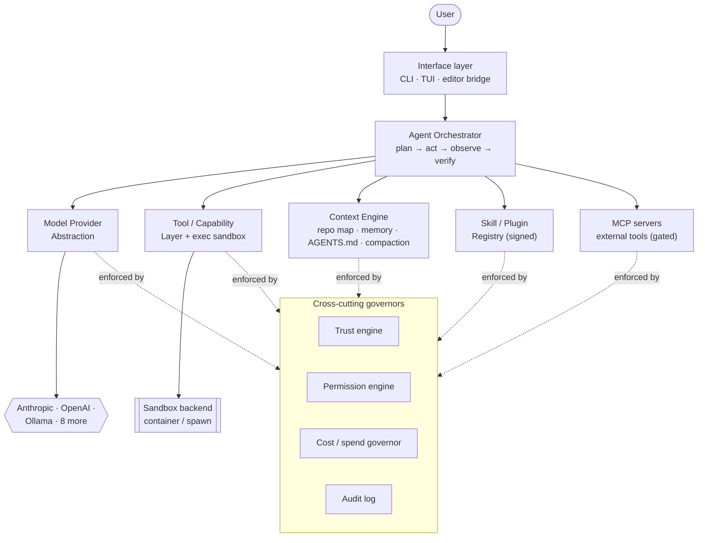
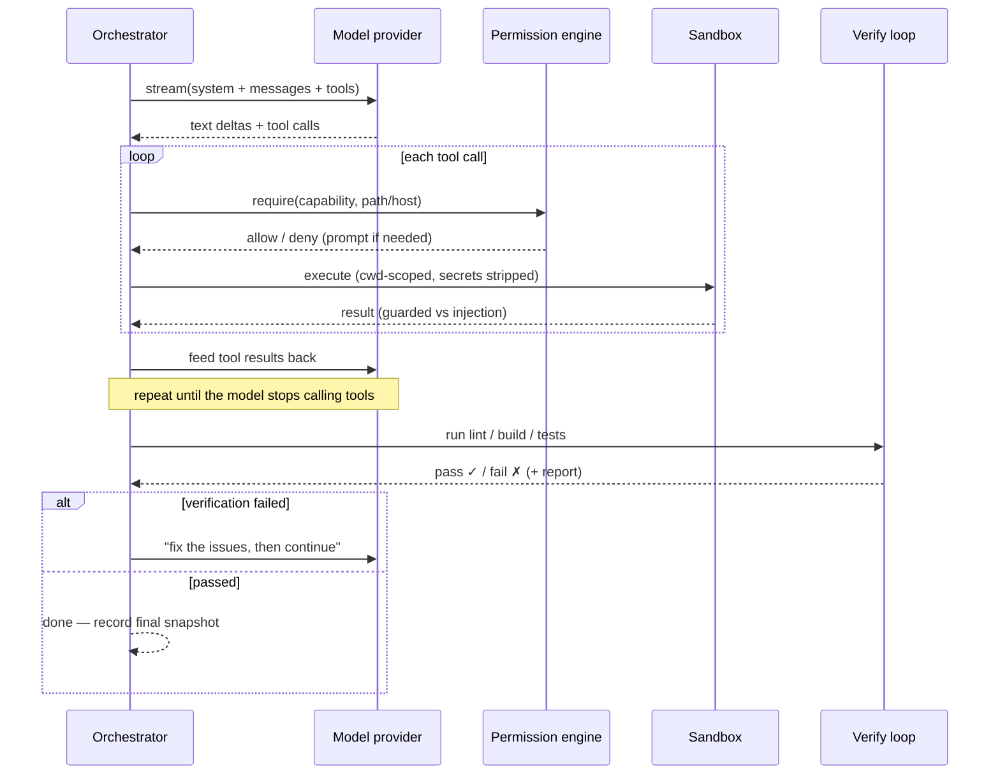
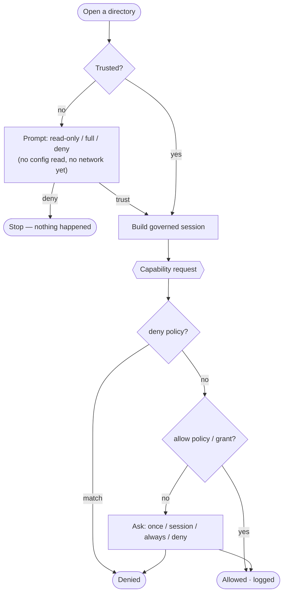
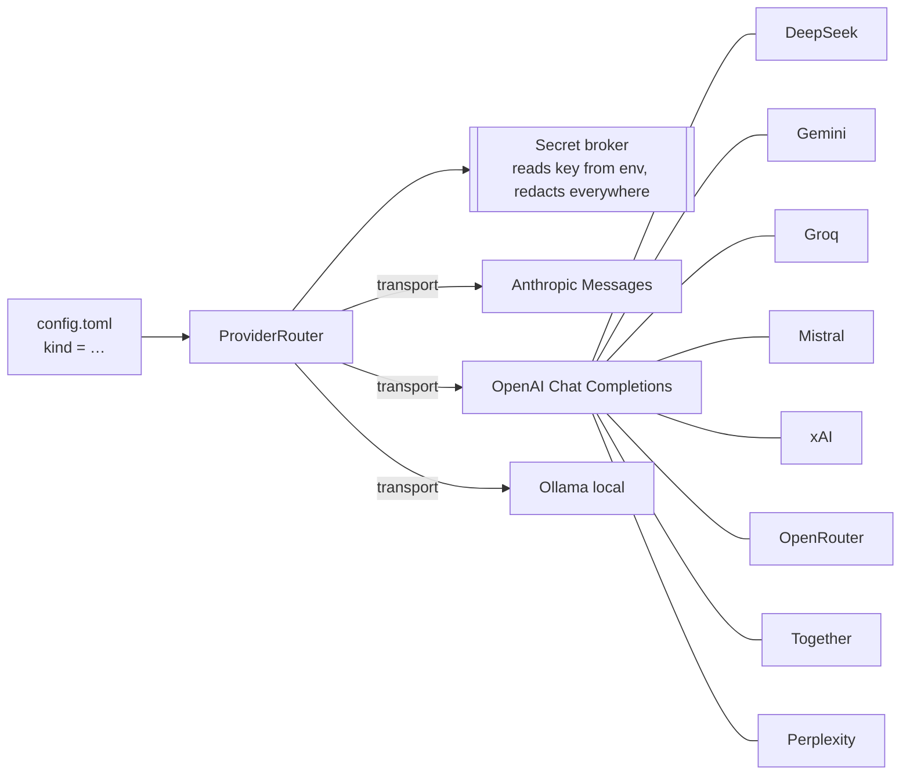
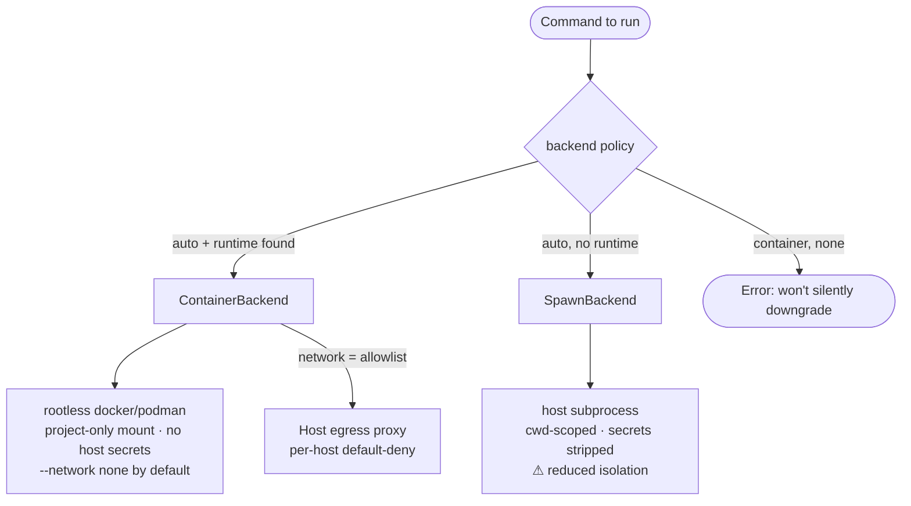
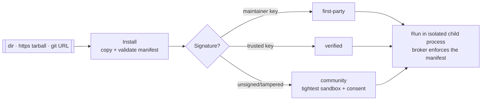
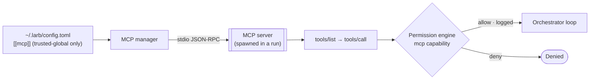

# Architecture

Larb is a TypeScript monorepo (pnpm workspaces). Every component is a spec-able
module behind a clean interface, so no model, provider, or sandbox technology is
privileged in the codebase.

## High-level overview

The interface layer talks to an **orchestrator** that drives a plan → act →
observe → verify loop. The orchestrator draws on four subsystems and is wrapped
by **cross-cutting governors** that enforce trust, permissions, spend, and audit
on every action.



## The agent loop

A `run` is not "done" until the project's verification commands pass (or the
iteration budget is exhausted). The loop persists a durable snapshot every
iteration, so an interrupted run can be resumed exactly where it stopped.



**Multi-agent mode.** A strong _orchestrator_ model can delegate scoped subtasks
to a cheaper _worker_ model (the DeepSeek Pro/Flash pattern, generalized across
providers). Workers share the permission engine and cost governor and get no
delegate tool of their own, which bounds recursion.

## Trust & permission flow

This is the headline security behaviour. On opening a directory, Larb reads
**zero** executable config and makes **zero** network calls until you decide.
Thereafter every capability use is checked, layered, and logged.



Repo-level config can _propose_ models, verification commands, and lower spend
limits — but it can **never** set the API base URL, choose the key env var, add
allow-rules, raise limits, weaken sandbox isolation, or trigger execution.

## Model provider abstraction

A thin interface — `generate`, `stream`, `countTokens`, `estimateCost` — with
adapters for the Anthropic Messages API, OpenAI Chat Completions, and a local
Ollama adapter. Most providers expose an OpenAI-compatible API, so they share a
single audited adapter; adding one is a new row in a preset table, not new code.



Routing is declarative policy, not hardcoded: **orchestration → strong model**,
**subagents / compaction → cheap, fast model**, **offline → local**. The API key
is read once by the secret broker and handed only to the adapter — the agent
loop and tools never see it.

## Execution sandbox

Command execution runs through a **pluggable backend** behind one interface.



The active isolation level is printed at the start of every run, so the trust
decision stays informed. The container backend is the SPEC's Codex-parity
isolation primitive; a microVM backend can slot in behind the same seam later.

## Context engine

- **Repo map** — an incremental structural index for cross-file reasoning.
- **Memory** — local, inspectable markdown on disk, per-project scope.
- **Project instructions (`AGENTS.md`)** — `AGENTS.md` and `.larb/AGENTS.md` are
  loaded as advisory system-prompt context (size-bounded). They shape how the
  agent approaches the task but can never override the safety principles or the
  permission engine.
- **Compaction** — proactive summarization with the cheap worker model so long
  sessions stay cheap and don't overflow the context window.
- **Injection guard** — untrusted tool/repo output is screened for injected
  instructions before it re-enters the model context.

## Skill & plugin registry



Every skill ships a **manifest** declaring exactly the capabilities it needs (fs
paths, network hosts, exec, secrets). The broker enforces that manifest against
both the declaration and the permission engine — **install ≠ trust**.

## MCP (external tools)

Larb speaks the **Model Context Protocol**, so you can plug in external tool
servers (filesystem, GitHub, databases, or your own) and the agent uses them
like any built-in tool.



- Each remote tool is surfaced as `mcp__<server>__<tool>` and is **permission-
  gated** by an `mcp` capability scoped to the server; every call is audited and
  its output passes through the injection guard.
- `[[mcp]]` config is **trusted-global-only** — a stdio server spawns a command,
  so an untrusted repo can never define one. Servers connect only **inside a
  run** (after a trust decision) and are torn down when it ends.
- Inspect configured servers with `larb mcp`, or connect and list their tools
  with `larb mcp probe`.

## Repository layout

```
packages/
  governors/   trust · permission · cost · audit · secret broker
  providers/   model adapters · routing · conformance suite
  sandbox/     pluggable execution isolation · egress proxy
  context/     repo map · markdown memory · AGENTS.md · compaction
  core/        orchestrator loop · tools · run state · bench · worktrees
  skills/      skill + plugin runtime · manifest · signing · broker
  mcp/         Model Context Protocol client · stdio transport · tool broker
  cli/         CLI · Ink TUI · editor bridge
skills-sdk/    TypeScript SDK for community skills
```

Continue to the **[comparison](/comparison)** or the **[security model](/security)**.
