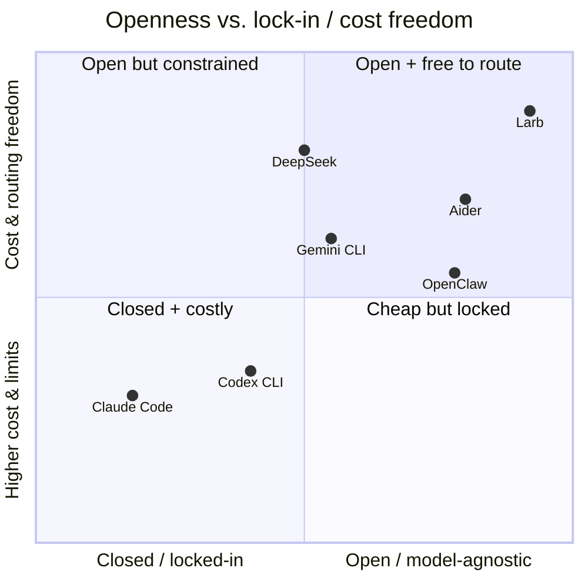

# Comparison with other coding agents

Each current-generation coding agent wins on one axis and loses on others. Larb
is designed to occupy the **union of their strengths** while closing their
documented weaknesses. This table is the project's north star — every feature
traces back to a row here.

## The landscape

| Competitor | Its strength (match or exceed) | Its weakness (our wedge) | How Larb addresses it |
|---|---|---|---|
| **Claude Code** | Best-in-class code quality, deep git sense, subagents, MCP | Closed client; hard Anthropic lock-in; tight shared rate limits; a flaw class where opening an untrusted repo could trigger RCE / key exfiltration before the trust prompt | Fully open client; pluggable providers; BYO-key + local routing removes rate-limit cliffs; **trust-before-anything** boot |
| **OpenAI Codex CLI** | Strong Docker sandbox; Rust speed; open; parallel sandboxes | Locked to OpenAI; pricey; weak multi-agent orchestration | Match the sandbox as a first-class primitive; first-class multi-agent; model-agnostic so cost is your choice |
| **Gemini CLI** | Free 1M-token context; open, auditable | Locked to Gemini; lags on SWE-bench; better at exploration than production | Provider-agnostic large context; **mandatory verification loop** so output is shippable |
| **DeepSeek (Deep Code)** | Very cheap; strong reasoning; orchestrator+worker split; 1M context | No built-in test feedback loop in some clients; no proactive compaction | Adopt the orchestrator/worker split natively; **mandatory verification**; proactive compaction + snapshots |
| **Aider** | Model-agnostic, excellent git discipline, repo map, auto lint/test | A pair programmer, not an autonomous orchestrator | Keep the git discipline + repo map + auto lint/test; add full autonomous orchestration on top |
| **OpenClaw** | MIT, local-first, SKILL.md + plugin ecosystem, heartbeat daemon | ~26% of analyzed community skills had ≥1 vulnerability; misconfigured heartbeat can burn money | Emulate the extensibility, but with **signed/sandboxed skills, a permission manifest, and a hard spend governor** |

## Where Larb sits

Larb deliberately targets the **open + safe + unlocked + cheap** corner that the
others each miss on at least one axis.

## Capability matrix

| Capability | Claude Code | Codex CLI | Gemini CLI | Aider | OpenClaw | **Larb** |
|---|:--:|:--:|:--:|:--:|:--:|:--:|
| Open-source client | ✗ | ✓ | ✓ | ✓ | ✓ | **✓** |
| Model-agnostic | ✗ | ✗ | ✗ | ✓ | partial | **✓** |
| Container/VM sandbox | partial | ✓ | ✗ | ✗ | partial | **✓** |
| Trust-before-execution boot | ✗ | partial | ✗ | ✗ | ✗ | **✓** |
| Mandatory verification loop | partial | partial | ✗ | ✓ | ✗ | **✓** |
| Hard spend limits | ✗ | ✗ | ✗ | ✗ | ✗ | **✓** |
| Signed + manifested skills | n/a | n/a | n/a | n/a | ✗ | **✓** |
| Multi-agent orchestration | ✓ | partial | ✗ | ✗ | partial | **✓** |
| Append-only audit log | partial | partial | ✗ | ✓(git) | ✗ | **✓** |

> Marks reflect the project's design targets and public knowledge of each tool;
> they are a positioning guide, not a benchmark. Independent
> [SWE-bench](/roadmap#quality) numbers are tracked on the roadmap.

## What this means in practice

- **You are never rate-limited into a corner.** When one provider throttles or
  prices up, change one line — or route to a local model — and keep working.
- **Opening an untrusted repo is safe by default.** The exact failure class
  behind recent agent RCE / key-exfiltration findings is *designed out*: no
  config-as-code runs on load, and the API base URL can't be redirected by repo
  config. See the [security model](/security).
- **Output is shippable, not just plausible.** The verification loop is
  mandatory, not optional.
- **Community power without community-vulnerability risk.** Skills are signed,
  manifested, and sandboxed; install never implies trust.

Next: the **[roadmap](/roadmap)**.
