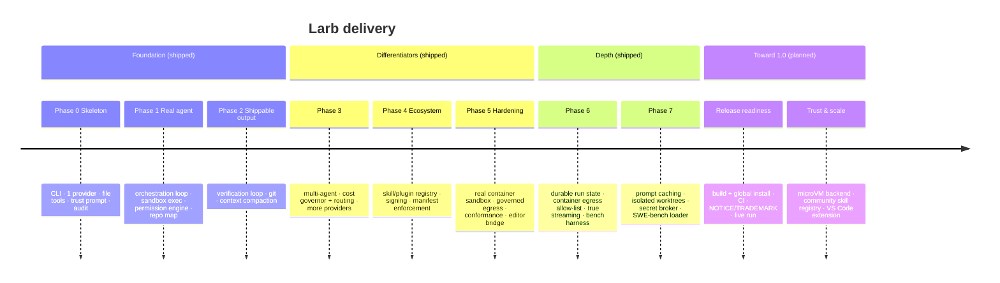

# Roadmap

Larb ships in vertical slices. Phases 0–7 are **built and tested** (the engine,
the security model, the ecosystem, and the eval tooling); the path ahead turns
the alpha into a tool developers install and trust.

> Status legend: ✅ shipped · 🟡 partial / unverified live · 🔜 planned

## Timeline

## What's shipped (phases 0–7)

| Area | Status | Notes |
|---|:--:|---|
| Trust-before-anything boot | ✅ | No config-as-code, no network before consent |
| Capability tools + permission engine | ✅ | Layered allow/deny, project policy, every grant logged |
| Hard spend governor | ✅ | Halts the agent before overspend (run / session / day) |
| Model-agnostic providers (11) | ✅ | One config line; conformance suite |
| Orchestration + verification loop | ✅ | Mandatory lint/build/test before "done" |
| Multi-agent delegation | ✅ | Strong orchestrator → cheap worker |
| Real container sandbox | 🟡 | Built + unit-tested; needs **live** verification on a host with docker/podman |
| Governed network egress | ✅ | `http_fetch` + container egress allow-list proxy |
| Durable run state | ✅ | `larb runs` / `larb resume` |
| True streaming (SSE / NDJSON) | ✅ | OpenAI + Ollama incremental; Anthropic caching |
| Signed, manifested skills | ✅ | Install from dir / tarball / git; install ≠ trust |
| Secret broker | ✅ | Single redacting env boundary |
| Benchmark harness | ✅ | Resolution rate + cost/task, worktree isolation |
| SWE-bench harness | 🟡 | Loader + grading primitives; full graded runs need dataset repos |
| CLI · TUI · editor bridge | ✅ | Streaming, diff review, approvals, live cost meter |

## What's next (toward 1.0)

### Release readiness 🔜
- **A confirmed end-to-end live run** against a real provider (the #1 gate).
- **Live container-sandbox verification** on a host with a runtime.
- Published `npm i -g @larb/cli`, CI, changelog, and legal files.

### Trust & scale 🔜
- **MicroVM sandbox backend** behind the existing seam — airtight raw-socket
  egress blocking, not just proxy-respecting clients.
- **Community skill registry** with provenance and a public manifest schema.
- **Full SWE-bench grading** wired to the dataset + per-repo test commands.
- **Parallel multi-agent** using isolated git worktrees, with deliberate merge.

### Reach 🔜
- **VS Code / JetBrains extension** consuming the `larb bridge` protocol.
- **Single-binary distribution** (Bun / `pkg`) for zero-Node installs.
- **Deno runtime spike** — its `--allow-*` model maps onto our capability sandbox.
- Editor-native plan view and richer diff review.

## Quality {#quality}

Success is measured, not asserted:

- **Resolution rate** — SWE-bench Verified, via the `larb bench` harness.
- **Safety** — zero "config-triggered execution" or "secret-before-consent"
  findings in red-team review; % of skills with manifest enforcement.
- **Cost** — dollars per resolved task vs. a Claude-Code / Codex baseline.
- **Portability** — number of providers passing the conformance suite.
- **Ecosystem** — community skills published; % signed / verified.

Non-goals (for now): a hosted SaaS backend, training our own foundation model, a
full IDE, and multi-channel chat gateways.

See the **[architecture](/architecture)** and **[security model](/security)**.
