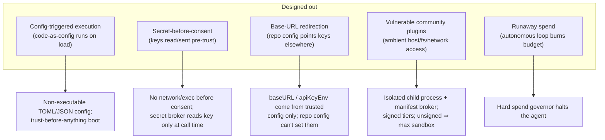
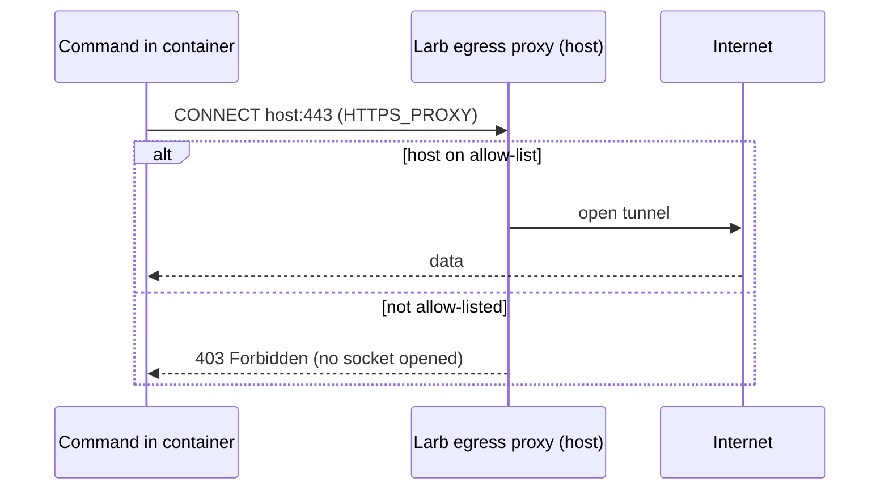

# Security model

Security is Larb's differentiator, not a feature bolted on. The design goal is
simple: **opening an untrusted repository should be safe by default.** This page
explains the attack classes Larb designs out and the mechanisms that enforce it.

## Principles

1. **Safe by default, powerful by consent.** Nothing networked or executed runs
   before an explicit, informed trust decision. Dangerous capabilities are
   opt-in and scoped, never global.
2. **Verify, don't trust the model.** Every change is checked against tests /
   linters / build before it is called done.
3. **Cost is enforced, not just surfaced.** Hard limits halt the agent.
4. **Extensible, but governed.** Community power without community-vulnerability
   risk.

## Attack classes designed out

This is the exact failure class behind recent agent **RCE / key-exfiltration**
findings: an untrusted repo's config or content triggering execution or leaking
credentials before the user is ever asked. In Larb it cannot happen.

## The mechanisms

### Trust-before-anything boot
On opening any directory, Larb reads **zero** executable/config-as-code and makes
**zero** network calls until you make a trust decision. Repo-level config can
*propose* settings but can never *trigger* execution, override approvals, raise
spend limits, weaken isolation, or silently change the API base URL.

### Capability sandbox
All command execution and all skills run in a sandbox. The production backend is
a **rootless container** (docker/podman): the project is bind-mounted, the host
filesystem outside it is invisible, no host environment (and therefore no
secret) crosses in, and **networking is off by default** (`--network none`).
Where no runtime is present, Larb falls back to a reduced-isolation host
subprocess **and tells you so** — the trust decision stays informed.

### Permission engine
Fine-grained, layered approvals — per-capability, per-path, per-host — with
"allow once / for the session / always / deny" and a project policy file. A safe
autonomy mode is achievable *because the sandbox is real*, not by a
`--dangerously-skip-permissions` escape hatch. Every grant is logged.

### Network egress, default-deny
The agent's one in-process network path is an `http_fetch` tool gated per-host
by the `net` capability. Under the container backend in allow-list mode, command
egress is routed through a **host egress proxy** that permits only configured
hosts (proxy-respecting clients); everything else is denied.

### Secrets isolation
The agent never sees raw API keys. A **secret broker** is the single boundary
that reads a key from the environment, hands it only to the provider adapter,
and redacts itself in every serialization path (JSON, logs, inspect). Repo
config can never redirect which env var is read.

### Manifest-enforced, signed skills
Every skill ships a manifest declaring exactly the capabilities it needs. Skills
run in an isolated child process; the broker enforces the manifest against both
the declaration and the permission engine. Three trust tiers — **first-party**
(maintainer-signed), **verified** (trusted-key-signed), **community** (unsigned →
tightest sandbox + explicit consent). **Install ≠ trust.**

### Hard spend governor
Live token and dollar accounting per run, per session, per day, with limits that
**halt** the agent before overspend — directly preventing the "heartbeat burned
hundreds overnight" failure mode.

### Append-only audit log
A local, human-readable record of every tool call, permission grant, model call,
and cost — for trust, debugging, and incident review.

## Reporting

A documented threat model and a coordinated-disclosure policy live in the repo.
Please report vulnerabilities via the process in `SECURITY.md` rather than a
public issue.

Back to the **[architecture](/architecture)** or the **[roadmap](/roadmap)**.
