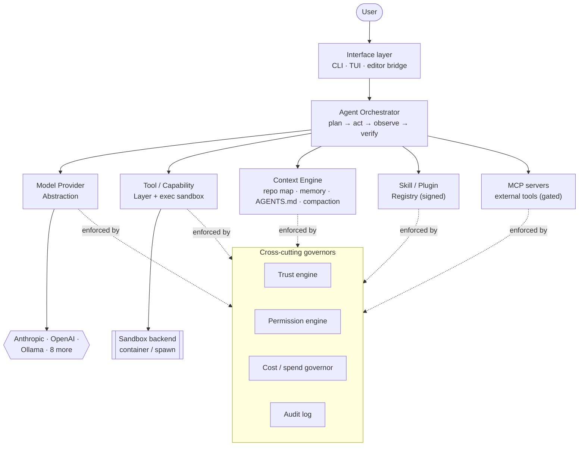
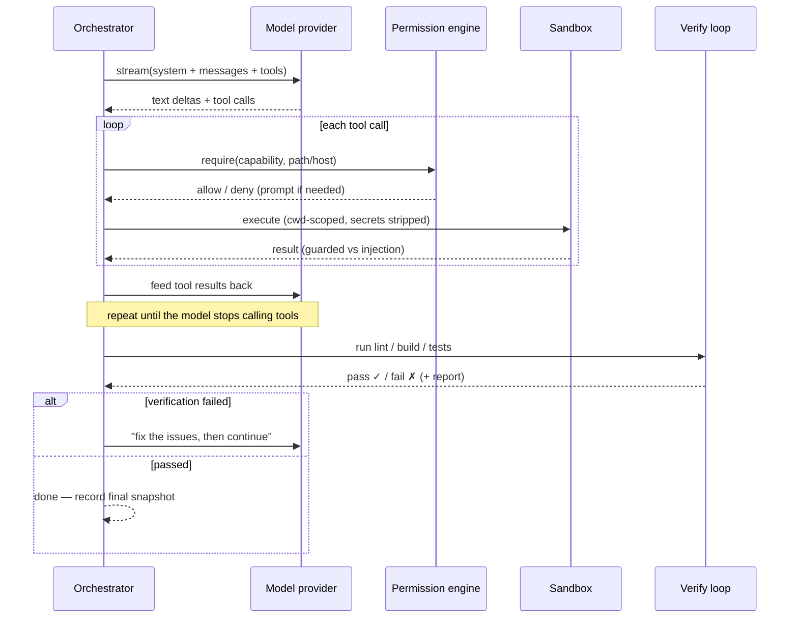
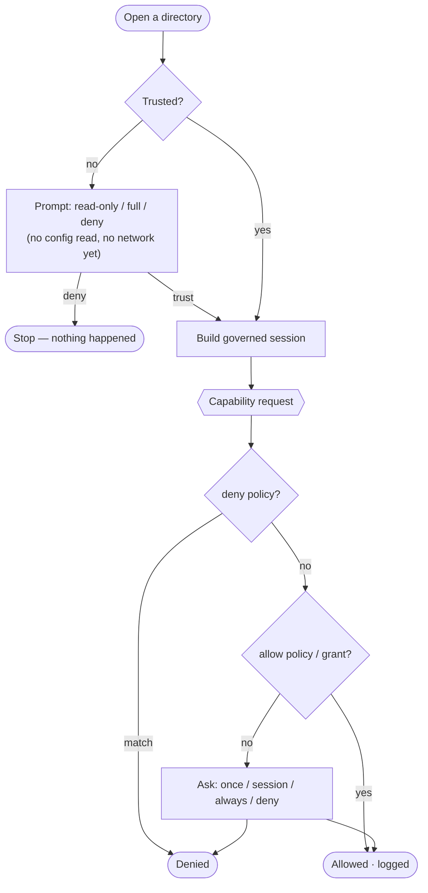
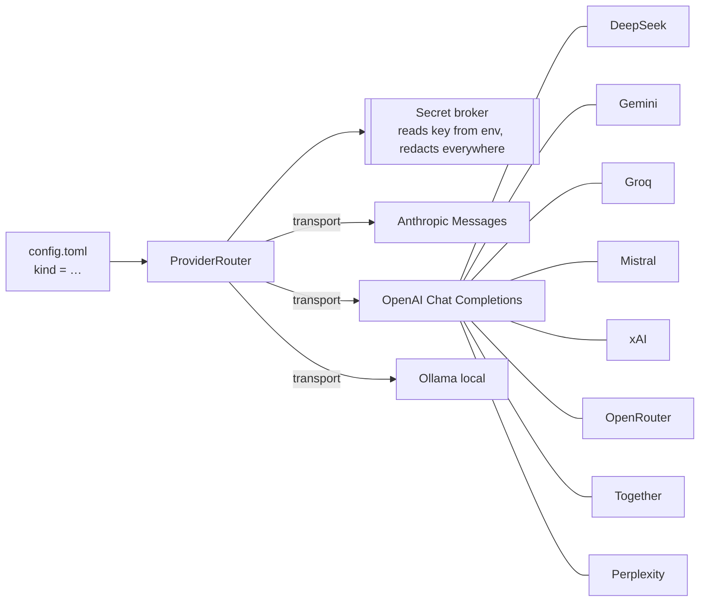
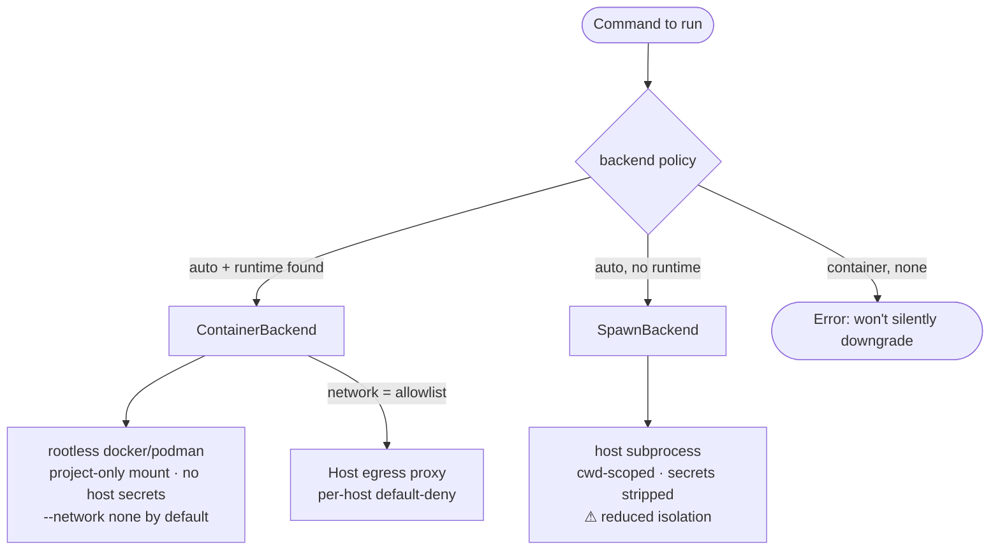
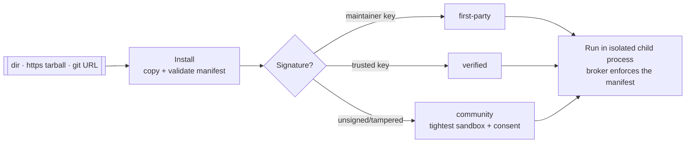
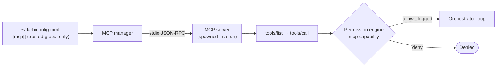

# สถาปัตยกรรม

Larb เป็นมอนอรีโพ TypeScript (pnpm workspaces) ทุกองค์ประกอบเป็นโมดูลที่ระบุสเปกได้
อยู่เบื้องหลังอินเทอร์เฟซที่สะอาด ดังนั้นจึงไม่มีโมเดล ผู้ให้บริการ หรือเทคโนโลยี
แซนด์บ็อกซ์ใดได้รับสิทธิพิเศษในโค้ดเบส

## ภาพรวมระดับสูง

ชั้นอินเทอร์เฟซสื่อสารกับ **ออร์เคสเตรเตอร์** ที่ขับเคลื่อนลูป วางแผน → ลงมือ →
สังเกต → ตรวจสอบ ออร์เคสเตรเตอร์ใช้ระบบย่อยสี่ส่วน และถูกห่อด้วย **ตัวควบคุม
ข้ามระบบ** ที่บังคับใช้ความเชื่อถือ สิทธิ์ ค่าใช้จ่าย และการตรวจสอบในทุกการกระทำ



## ลูปของเอเจนต์

งาน `run` ยังไม่ถือว่า "เสร็จ" จนกว่าคำสั่งตรวจสอบของโปรเจกต์จะผ่าน (หรือใช้
จำนวนรอบจนหมดงบ) ลูปจะบันทึกสแน็ปช็อตถาวรทุกรอบ ทำให้รันที่ถูกขัดจังหวะ
กลับมาทำต่อจากจุดเดิมได้พอดี



**โหมดหลายเอเจนต์** โมเดล *ออร์เคสเตรเตอร์* ที่แข็งแรงสามารถมอบหมายงานย่อยที่
จำกัดขอบเขตให้โมเดล *เวิร์กเกอร์* ที่ถูกกว่า (รูปแบบ Pro/Flash ของ DeepSeek ที่
นำมาใช้ทั่วไปข้ามผู้ให้บริการ) เวิร์กเกอร์ใช้เอนจินสิทธิ์และตัวควบคุมค่าใช้จ่าย
ร่วมกัน และไม่มีเครื่องมือมอบหมายของตัวเอง จึงจำกัดการเรียกซ้อนได้

## กระแสความเชื่อถือและสิทธิ์

นี่คือพฤติกรรมด้านความปลอดภัยที่เป็นจุดเด่น เมื่อเปิดไดเรกทอรี Larb อ่านคอนฟิก
ที่เป็นโค้ด **ศูนย์** ไฟล์ และเรียกเครือข่าย **ศูนย์** ครั้ง จนกว่าคุณจะตัดสินใจ
หลังจากนั้นทุกการใช้ความสามารถจะถูกตรวจ เป็นชั้น และบันทึกไว้



คอนฟิกระดับรีโพสามารถ *เสนอ* โมเดล คำสั่งตรวจสอบ และลดเพดานค่าใช้จ่ายได้ — แต่
**ไม่มีวัน** ตั้ง base URL ของ API เลือกตัวแปรสภาพแวดล้อมของคีย์ เพิ่มกฎอนุญาต
เพิ่มเพดาน ลดความเข้มของแซนด์บ็อกซ์ หรือสั่งรันโค้ดได้

## การนามธรรมผู้ให้บริการโมเดล

อินเทอร์เฟซบาง ๆ — `generate`, `stream`, `countTokens`, `estimateCost` — พร้อม
อะแดปเตอร์สำหรับ Anthropic Messages API, OpenAI Chat Completions และ Ollama ในเครื่อง
ผู้ให้บริการส่วนใหญ่เปิด API ที่เข้ากันได้กับ OpenAI จึงใช้อะแดปเตอร์ที่ตรวจสอบแล้ว
ตัวเดียวร่วมกัน การเพิ่มผู้ให้บริการคือการเพิ่มแถวในตารางพรีเซ็ต ไม่ใช่เขียนโค้ดใหม่



การกำหนดเส้นทางเป็นนโยบายที่ประกาศได้ ไม่ใช่ฮาร์ดโค้ด: **ออร์เคสเตรชัน → โมเดลแรง**,
**ซับเอเจนต์ / การบีบอัด → โมเดลถูกและเร็ว**, **ออฟไลน์ → โมเดลในเครื่อง** คีย์ API
ถูกอ่านครั้งเดียวโดยตัวรับฝากความลับ และส่งให้เฉพาะอะแดปเตอร์ — ลูปเอเจนต์และ
เครื่องมือไม่เคยเห็นคีย์

## แซนด์บ็อกซ์การรันคำสั่ง

การรันคำสั่งทำผ่าน **แบ็กเอนด์แบบเสียบเปลี่ยนได้** เบื้องหลังอินเทอร์เฟซเดียว



ระดับการแยกสภาพแวดล้อมที่ใช้งานอยู่จะถูกแสดงตอนเริ่มทุกการรัน เพื่อให้การตัดสินใจ
ไว้วางใจมีข้อมูลครบ แบ็กเอนด์คอนเทนเนอร์คือพรีมิทีฟการแยกระดับเดียวกับ Codex และ
สามารถเสียบแบ็กเอนด์ไมโครวีเอ็มเข้าที่รอยต่อเดิมได้ในภายหลัง

## เอนจินบริบท

- **แผนผังรีโพ** — ดัชนีโครงสร้างแบบเพิ่มทีละส่วนสำหรับการให้เหตุผลข้ามไฟล์
- **หน่วยความจำ** — มาร์กดาวน์บนดิสก์ที่ตรวจสอบได้ ขอบเขตต่อโปรเจกต์
- **คำแนะนำของโปรเจกต์ (`AGENTS.md`)** — ไฟล์ `AGENTS.md` และ `.larb/AGENTS.md` ถูก
  โหลดเข้าเป็นบริบทเชิงแนะนำใน system prompt (จำกัดขนาด) ใช้ชี้แนะแนวทางการทำงานของ
  เอเจนต์ได้ แต่ไม่สามารถลบล้างหลักความปลอดภัยหรือเอนจินสิทธิ์ได้
- **การบีบอัด** — สรุปเชิงรุกด้วยโมเดลเวิร์กเกอร์ราคาถูก เพื่อให้เซสชันยาว ๆ ยัง
  ประหยัดและไม่ล้นหน้าต่างบริบท
- **ตัวป้องกันการแทรกคำสั่ง** — เอาต์พุตจากเครื่องมือ/รีโพที่ไม่น่าเชื่อถือจะถูก
  คัดกรองหาคำสั่งที่ถูกแทรกก่อนกลับเข้าสู่บริบทของโมเดล

## รีจิสทรีสกิลและปลั๊กอิน



ทุกสกิลมาพร้อม **แมนิเฟสต์** ที่ประกาศความสามารถที่ต้องใช้อย่างชัดเจน (เส้นทาง fs,
โฮสต์เครือข่าย, การรันคำสั่ง, ความลับ) ตัวรับฝากบังคับใช้แมนิเฟสต์นั้นทั้งกับสิ่งที่
ประกาศและกับเอนจินสิทธิ์ — **ติดตั้ง ≠ เชื่อถือ**

## MCP (เครื่องมือภายนอก)

Larb รองรับ **Model Context Protocol** คุณจึงเชื่อมต่อเซิร์ฟเวอร์เครื่องมือภายนอก
(ระบบไฟล์, GitHub, ฐานข้อมูล หรือของคุณเอง) เข้ามาได้ และเอเจนต์จะใช้งานมันเหมือน
เครื่องมือในตัว



- เครื่องมือจากระยะไกลแต่ละตัวปรากฏเป็น `mcp__<server>__<tool>` และ **ผ่านการ
  ตรวจสิทธิ์** ด้วยความสามารถ `mcp` ที่จำกัดขอบเขตตามเซิร์ฟเวอร์ ทุกการเรียกถูก
  บันทึก และเอาต์พุตผ่านตัวป้องกันการแทรกคำสั่ง
- คอนฟิก `[[mcp]]` อยู่ใน **คอนฟิกระดับโกลบอลที่เชื่อถือเท่านั้น** — เพราะเซิร์ฟเวอร์
  stdio สั่งรันคำสั่งได้ รีโพที่ไม่น่าเชื่อถือจึงนิยามมันไม่ได้ เซิร์ฟเวอร์จะเชื่อมต่อ
  **เฉพาะระหว่างการรัน** (หลังตัดสินใจเชื่อถือ) และถูกปิดเมื่อจบ
- ดูเซิร์ฟเวอร์ที่ตั้งค่าไว้ด้วย `larb mcp` หรือเชื่อมต่อเพื่อแสดงเครื่องมือด้วย
  `larb mcp probe`

## โครงสร้างที่เก็บโค้ด

```
packages/
  governors/   trust · permission · cost · audit · secret broker
  providers/   model adapters · routing · conformance suite
  sandbox/     pluggable execution isolation · egress proxy
  context/     repo map · markdown memory · AGENTS.md · compaction
  core/        orchestrator loop · tools · run state · bench · worktrees
  skills/      skill + plugin runtime · manifest · signing · broker
  mcp/         Model Context Protocol client · stdio transport · tool broker
  cli/         CLI · Ink TUI · editor bridge
skills-sdk/    TypeScript SDK สำหรับสกิลของชุมชน
```

อ่านต่อที่ **[เปรียบเทียบ](/th/comparison)** หรือ **[แบบจำลองความปลอดภัย](/th/security)**
