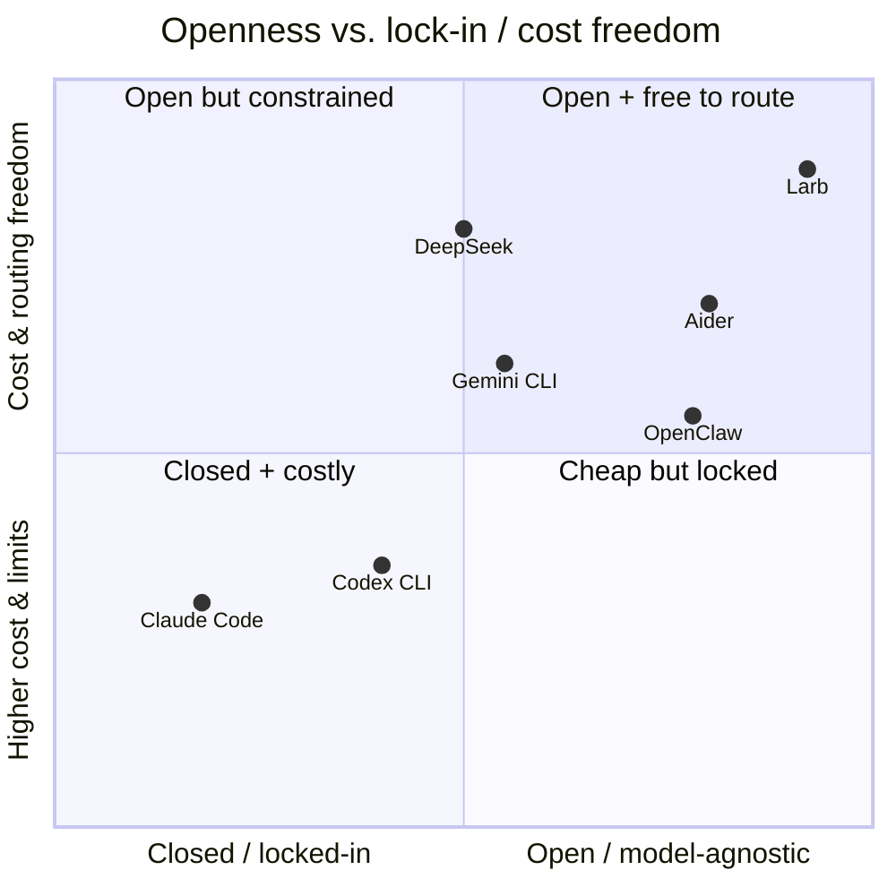

# เปรียบเทียบกับเอเจนต์เขียนโค้ดอื่น

เอเจนต์เขียนโค้ดยุคปัจจุบันแต่ละตัวชนะในแกนหนึ่งแต่แพ้ในแกนอื่น Larb ถูกออกแบบให้
ครอบครอง **จุดร่วมของจุดแข็งทั้งหมด** พร้อมปิดจุดอ่อนที่บันทึกไว้ ตารางนี้คือ
ดาวเหนือของโปรเจกต์ — ทุกฟีเจอร์ย้อนกลับไปหาแถวใดแถวหนึ่งที่นี่ได้

## ภูมิทัศน์

| คู่แข่ง | จุดแข็ง (เทียบเท่าหรือเหนือกว่า) | จุดอ่อน (ช่องที่เราเจาะ) | Larb แก้อย่างไร |
|---|---|---|---|
| **Claude Code** | คุณภาพโค้ดระดับท็อป เข้าใจ git ลึก ซับเอเจนต์ MCP | ไคลเอนต์ปิด ผูกกับ Anthropic เรตลิมิตใช้ร่วมกันแน่น และคลาสช่องโหว่ที่เปิดรีโพไม่น่าเชื่อถือแล้วอาจถูก RCE/ขโมยคีย์ก่อนถามความเชื่อถือ | ไคลเอนต์เปิดทั้งหมด ผู้ให้บริการเสียบเปลี่ยนได้ ใช้คีย์ตัวเอง + โมเดลในเครื่องลบเพดานเรตลิมิต บูตแบบ **เชื่อถือก่อนทำสิ่งใด** |
| **OpenAI Codex CLI** | แซนด์บ็อกซ์ Docker แข็งแรง เร็วด้วย Rust เปิดซอร์ส แซนด์บ็อกซ์ขนาน | ผูกกับ OpenAI ราคาสูง ออร์เคสเตรชันหลายเอเจนต์อ่อน | ทำให้แซนด์บ็อกซ์เป็นพรีมิทีฟระดับแรก หลายเอเจนต์เต็มรูปแบบ ไม่ผูกโมเดลให้ต้นทุนเป็นทางเลือกของคุณ |
| **Gemini CLI** | บริบท 1M โทเค็นฟรี เปิดและตรวจสอบได้ | ผูกกับ Gemini ตามหลังบน SWE-bench เก่งสำรวจมากกว่าผลิตจริง | บริบทใหญ่แบบไม่ผูกผู้ให้บริการ **ลูปตรวจสอบบังคับใช้** ให้ผลลัพธ์พร้อมส่ง |
| **DeepSeek (Deep Code)** | ถูกมาก ให้เหตุผลแข็ง แยกออร์เคสเตรเตอร์+เวิร์กเกอร์ บริบท 1M | บางไคลเอนต์ไม่มีลูปป้อนกลับผลทดสอบ ไม่มีการบีบอัดเชิงรุก | รับรูปแบบแยกออร์เคสเตรเตอร์/เวิร์กเกอร์มาใช้แต่กำเนิด **ตรวจสอบบังคับใช้** บีบอัด + สแน็ปช็อตเชิงรุก |
| **Aider** | ไม่ผูกโมเดล วินัย git ดีเยี่ยม แผนผังรีโพ lint/test อัตโนมัติ | เป็นคู่หูจับคู่เขียน ไม่ใช่ออร์เคสเตรเตอร์อัตโนมัติ | คงวินัย git + แผนผังรีโพ + lint/test อัตโนมัติ แล้วเพิ่มออร์เคสเตรชันอัตโนมัติเต็มรูปแบบ |
| **OpenClaw** | MIT, โลคัลเฟิร์สต์, ระบบ SKILL.md + ปลั๊กอิน, เดมอน heartbeat | ~26% ของสกิลชุมชนที่วิเคราะห์มีช่องโหว่ ≥1 จุด heartbeat ตั้งผิดอาจเผาเงินข้ามคืน | เลียนแบบความสามารถขยาย แต่ด้วย **สกิลที่เซ็น/แซนด์บ็อกซ์ แมนิเฟสต์สิทธิ์ และตัวควบคุมค่าใช้จ่ายเด็ดขาด** |

## Larb อยู่ตรงไหน

Larb เล็งไปยังมุม **เปิด + ปลอดภัย + ไม่ผูกขาด + ถูก** ที่ตัวอื่นพลาดอย่างน้อย
หนึ่งแกนอย่างจงใจ

## ตารางความสามารถ

| ความสามารถ | Claude Code | Codex CLI | Gemini CLI | Aider | OpenClaw | **Larb** |
|---|:--:|:--:|:--:|:--:|:--:|:--:|
| ไคลเอนต์โอเพนซอร์ส | ✗ | ✓ | ✓ | ✓ | ✓ | **✓** |
| ไม่ผูกโมเดล | ✗ | ✗ | ✗ | ✓ | บางส่วน | **✓** |
| แซนด์บ็อกซ์ container/VM | บางส่วน | ✓ | ✗ | ✗ | บางส่วน | **✓** |
| บูตแบบเชื่อถือก่อนรัน | ✗ | บางส่วน | ✗ | ✗ | ✗ | **✓** |
| ลูปตรวจสอบบังคับใช้ | บางส่วน | บางส่วน | ✗ | ✓ | ✗ | **✓** |
| เพดานค่าใช้จ่ายเด็ดขาด | ✗ | ✗ | ✗ | ✗ | ✗ | **✓** |
| สกิลเซ็น + แมนิเฟสต์ | – | – | – | – | ✗ | **✓** |
| ออร์เคสเตรชันหลายเอเจนต์ | ✓ | บางส่วน | ✗ | ✗ | บางส่วน | **✓** |
| บันทึกตรวจสอบเพิ่มอย่างเดียว | บางส่วน | บางส่วน | ✗ | ✓(git) | ✗ | **✓** |

> เครื่องหมายสะท้อนเป้าหมายการออกแบบของโปรเจกต์และความรู้สาธารณะของแต่ละเครื่องมือ
> เป็นแนวทางการวางตำแหน่ง ไม่ใช่ผลการวัดประสิทธิภาพ ตัวเลข
> [SWE-bench](/th/roadmap#คุณภาพ) อิสระติดตามอยู่ในโรดแมป

## ในทางปฏิบัติหมายความว่าอย่างไร

- **คุณไม่เคยถูกเรตลิมิตจนมุม** เมื่อผู้ให้บริการหนึ่งจำกัดหรือขึ้นราคา เปลี่ยน
  บรรทัดเดียว — หรือสลับไปโมเดลในเครื่อง — แล้วทำงานต่อ
- **เปิดรีโพที่ไม่น่าเชื่อถือได้อย่างปลอดภัยโดยปริยาย** คลาสความล้มเหลวเบื้องหลัง
  การค้นพบ RCE/ขโมยคีย์ในเอเจนต์ช่วงหลัง ถูก *ออกแบบให้หมดไป* ดู[แบบจำลองความปลอดภัย](/th/security)
- **ผลลัพธ์พร้อมส่ง ไม่ใช่แค่ดูเข้าท่า** ลูปตรวจสอบเป็นข้อบังคับ ไม่ใช่ตัวเลือก
- **พลังของชุมชนโดยไม่มีความเสี่ยงช่องโหว่ของชุมชน** สกิลถูกเซ็น มีแมนิเฟสต์ และ
  แซนด์บ็อกซ์ การติดตั้งไม่เคยหมายถึงการเชื่อถือ

ถัดไป: **[โรดแมป](/th/roadmap)**
