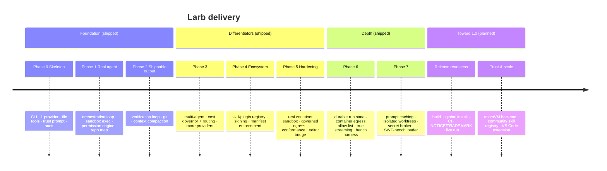

# โรดแมป

Larb ส่งมอบเป็นชิ้นแนวตั้ง เฟส 0–7 **สร้างและทดสอบแล้ว** (เอนจิน แบบจำลองความ
ปลอดภัย ระบบนิเวศ และเครื่องมือประเมิน) ส่วนเส้นทางข้างหน้าคือการเปลี่ยนอัลฟ่า
ให้เป็นเครื่องมือที่นักพัฒนาติดตั้งและไว้ใจได้

> สัญลักษณ์สถานะ: ✅ ส่งแล้ว · 🟡 บางส่วน/ยังไม่ยืนยันสด · 🔜 วางแผนไว้

## ไทม์ไลน์

## สิ่งที่ส่งมอบแล้ว (เฟส 0–7)

| ส่วน | สถานะ | หมายเหตุ |
|---|:--:|---|
| บูตแบบเชื่อถือก่อนทำสิ่งใด | ✅ | ไม่มีคอนฟิกที่เป็นโค้ด ไม่มีเครือข่ายก่อนยินยอม |
| เครื่องมือตามความสามารถ + เอนจินสิทธิ์ | ✅ | อนุญาต/ปฏิเสธเป็นชั้น นโยบายโปรเจกต์ บันทึกทุกการอนุมัติ |
| ตัวควบคุมค่าใช้จ่ายเด็ดขาด | ✅ | หยุดเอเจนต์ก่อนใช้จ่ายเกิน (ต่อรัน/เซสชัน/วัน) |
| ผู้ให้บริการไม่ผูกโมเดล (11 ราย) | ✅ | คอนฟิกบรรทัดเดียว มีชุดทดสอบความสอดคล้อง |
| ออร์เคสเตรชัน + ลูปตรวจสอบ | ✅ | บังคับ lint/build/test ก่อน "เสร็จ" |
| มอบหมายหลายเอเจนต์ | ✅ | ออร์เคสเตรเตอร์แรง → เวิร์กเกอร์ถูก |
| แซนด์บ็อกซ์คอนเทนเนอร์จริง | 🟡 | สร้าง + ทดสอบยูนิตแล้ว ต้องยืนยัน **สด** บนเครื่องที่มี docker/podman |
| การออกเครือข่ายที่ควบคุม | ✅ | `http_fetch` + พร็อกซีจำกัดโฮสต์ของคอนเทนเนอร์ |
| สถานะรันถาวร | ✅ | `larb runs` / `larb resume` |
| สตรีมจริง (SSE / NDJSON) | ✅ | OpenAI + Ollama แบบเพิ่มทีละส่วน Anthropic แคช |
| สกิลเซ็น + แมนิเฟสต์ | ✅ | ติดตั้งจากไดเรกทอรี/tarball/git ติดตั้ง ≠ เชื่อถือ |
| ตัวรับฝากความลับ | ✅ | ขอบเขตเดียวที่ปิดบังคีย์จากสภาพแวดล้อม |
| เครื่องมือเบนช์มาร์ก | ✅ | อัตราการแก้สำเร็จ + ต้นทุน/งาน แยกด้วย worktree |
| เครื่องมือ SWE-bench | 🟡 | โหลดเดอร์ + พรีมิทีฟการให้คะแนน รันเต็มต้องใช้รีโพชุดข้อมูล |
| CLI · TUI · editor bridge | ✅ | สตรีม ตรวจ diff อนุมัติ มิเตอร์ค่าใช้จ่ายสด |

## สิ่งที่จะทำต่อ (มุ่งสู่ 1.0)

### ความพร้อมปล่อยรุ่น 🔜
- **การรันจบสมบูรณ์แบบสด** กับผู้ให้บริการจริง (ด่านสำคัญที่สุด)
- **การยืนยันแซนด์บ็อกซ์คอนเทนเนอร์แบบสด** บนเครื่องที่มีรันไทม์
- เผยแพร่ `npm i -g @larb/cli`, CI, changelog และไฟล์ทางกฎหมาย

### ความเชื่อถือและสเกล 🔜
- **แบ็กเอนด์แซนด์บ็อกซ์ไมโครวีเอ็ม** ที่รอยต่อเดิม — บล็อกการออกระดับซ็อกเก็ตดิบ
  อย่างแน่นหนา ไม่ใช่แค่ไคลเอนต์ที่เคารพพร็อกซี
- **รีจิสทรีสกิลชุมชน** พร้อมที่มาและสคีมาแมนิเฟสต์สาธารณะ
- **การให้คะแนน SWE-bench เต็มรูปแบบ** ต่อกับชุดข้อมูล + คำสั่งทดสอบต่อรีโพ
- **หลายเอเจนต์ขนาน** ด้วย git worktree แยก พร้อมการรวมอย่างจงใจ

### การเข้าถึง 🔜
- **ส่วนขยาย VS Code / JetBrains** ที่ใช้โปรโตคอล `larb bridge`
- **การแจกจ่ายแบบไฟล์เดียว** (Bun / `pkg`) ติดตั้งโดยไม่ต้องมี Node
- **ทดลองรันไทม์ Deno** — โมเดล `--allow-*` แมปเข้ากับแซนด์บ็อกซ์ความสามารถของเรา
- มุมมองแผนในตัวบรรณาธิการและการตรวจ diff ที่สมบูรณ์ขึ้น

## คุณภาพ {#คุณภาพ}

ความสำเร็จถูกวัด ไม่ใช่กล่าวอ้าง:

- **อัตราการแก้สำเร็จ** — SWE-bench Verified ผ่านเครื่องมือ `larb bench`
- **ความปลอดภัย** — ศูนย์การค้นพบ "การรันที่ถูกคอนฟิกกระตุ้น" หรือ "ความลับก่อน
  ยินยอม" ในการทดสอบเจาะ; สัดส่วนสกิลที่บังคับแมนิเฟสต์
- **ต้นทุน** — ดอลลาร์ต่องานที่แก้สำเร็จเทียบกับฐาน Claude Code / Codex
- **ความพกพา** — จำนวนผู้ให้บริการที่ผ่านชุดทดสอบความสอดคล้อง
- **ระบบนิเวศ** — จำนวนสกิลชุมชนที่เผยแพร่; สัดส่วนที่เซ็น/ตรวจรับรอง

สิ่งที่ไม่ใช่เป้าหมาย (ตอนนี้): แบ็กเอนด์ SaaS แบบโฮสต์ การฝึกโมเดลพื้นฐานของเราเอง
IDE เต็มรูปแบบ และเกตเวย์แชตหลายช่องทาง

ดู **[สถาปัตยกรรม](/th/architecture)** และ **[แบบจำลองความปลอดภัย](/th/security)**
