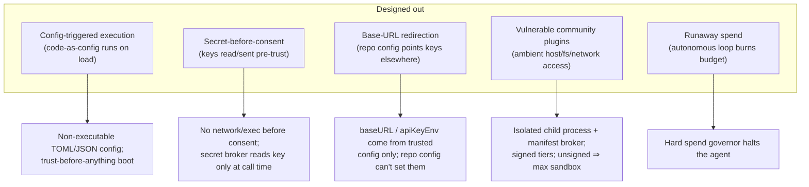
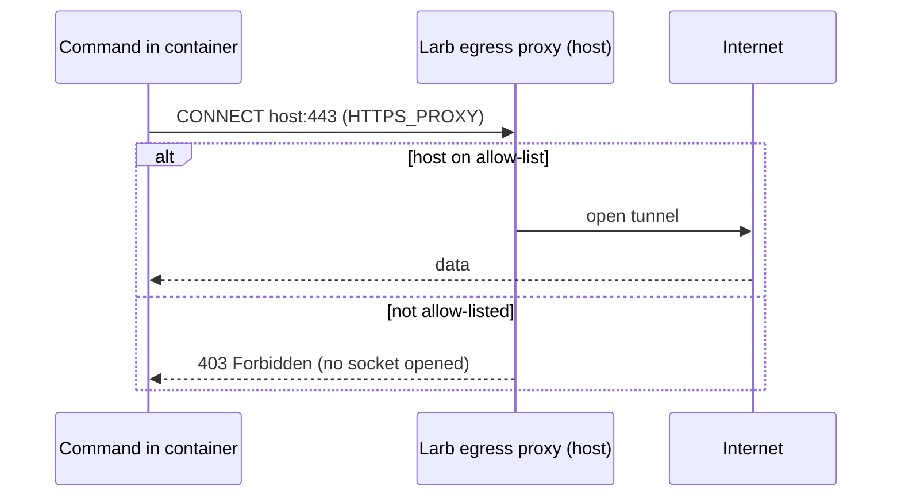

# แบบจำลองความปลอดภัย

ความปลอดภัยคือจุดต่างของ Larb ไม่ใช่ฟีเจอร์ที่แปะเพิ่มทีหลัง เป้าหมายการออกแบบ
เรียบง่าย: **การเปิดที่เก็บโค้ดที่ไม่น่าเชื่อถือควรปลอดภัยโดยปริยาย** หน้านี้
อธิบายคลาสการโจมตีที่ Larb ออกแบบให้หมดไป และกลไกที่บังคับใช้

## หลักการ

1. **ปลอดภัยโดยปริยาย ทรงพลังเมื่อยินยอม** ไม่มีการเชื่อมต่อเครือข่ายหรือรันคำสั่ง
   ก่อนการตัดสินใจไว้วางใจอย่างมีข้อมูล ความสามารถอันตรายต้องเปิดเองและจำกัดขอบเขต
2. **ตรวจสอบ ไม่ใช่เชื่อโมเดล** ทุกการเปลี่ยนแปลงถูกตรวจกับ test/lint/build ก่อน
   จะถือว่าเสร็จ
3. **ต้นทุนถูกบังคับ ไม่ใช่แค่แสดง** เพดานเด็ดขาดหยุดเอเจนต์
4. **ขยายได้ แต่ควบคุมได้** พลังชุมชนโดยไม่มีความเสี่ยงช่องโหว่ของชุมชน

## คลาสการโจมตีที่ออกแบบให้หมดไป

นี่คือคลาสความล้มเหลวที่อยู่เบื้องหลังการค้นพบ **RCE / การขโมยคีย์** ในเอเจนต์
ช่วงหลัง: คอนฟิกหรือเนื้อหาของรีโพที่ไม่น่าเชื่อถือกระตุ้นการรันหรือรั่วไหลข้อมูล
รับรองก่อนผู้ใช้จะถูกถาม ใน Larb มันเกิดขึ้นไม่ได้

## กลไก

### บูตแบบเชื่อถือก่อนทำสิ่งใด
เมื่อเปิดไดเรกทอรีใด Larb อ่านคอนฟิกที่เป็นโค้ด **ศูนย์** ไฟล์ และเรียกเครือข่าย
**ศูนย์** ครั้ง จนกว่าคุณจะตัดสินใจไว้วางใจ คอนฟิกระดับรีโพ *เสนอ* ค่าได้ แต่
**ไม่มีวัน** กระตุ้นการรัน ลบล้างการอนุมัติ เพิ่มเพดานค่าใช้จ่าย ลดความเข้มการแยก
หรือเปลี่ยน base URL ของ API อย่างเงียบ ๆ

### แซนด์บ็อกซ์ตามความสามารถ
การรันคำสั่งและสกิลทั้งหมดทำงานในแซนด์บ็อกซ์ แบ็กเอนด์สำหรับใช้งานจริงคือ
**คอนเทนเนอร์ไร้ราก** (docker/podman): โปรเจกต์ถูกเมานต์เข้า ระบบไฟล์โฮสต์
นอกเหนือจากนั้นมองไม่เห็น ไม่มีสภาพแวดล้อมโฮสต์ (จึงไม่มีความลับ) ข้ามเข้าไป และ
**ปิดเครือข่ายโดยปริยาย** (`--network none`) หากไม่มีรันไทม์ Larb จะถอยไปใช้
ซับโปรเซสบนโฮสต์ที่แยกน้อยลง **และแจ้งให้คุณทราบ** — การตัดสินใจไว้วางใจยังมีข้อมูลครบ

### เอนจินสิทธิ์
การอนุมัติแบบละเอียดและเป็นชั้น — ต่อความสามารถ ต่อเส้นทาง ต่อโฮสต์ — พร้อม
"อนุญาตครั้งเดียว / ตลอดเซสชัน / เสมอ / ปฏิเสธ" และไฟล์นโยบายโปรเจกต์ โหมด
อัตโนมัติที่ปลอดภัยทำได้ *เพราะแซนด์บ็อกซ์เป็นของจริง* ไม่ใช่ด้วยทางลัด
`--dangerously-skip-permissions` ทุกการอนุมัติถูกบันทึก

### การออกเครือข่าย ปฏิเสธโดยปริยาย
เส้นทางเครือข่ายในกระบวนการเดียวของเอเจนต์คือเครื่องมือ `http_fetch` ที่ควบคุม
ต่อโฮสต์ด้วยความสามารถ `net` ในโหมดอนุญาตของแบ็กเอนด์คอนเทนเนอร์ การออกของคำสั่ง
ถูกส่งผ่าน **พร็อกซีการออกบนโฮสต์** ที่อนุญาตเฉพาะโฮสต์ที่ตั้งค่าไว้ ที่เหลือถูกปฏิเสธ

### การแยกความลับ
เอเจนต์ไม่เคยเห็นคีย์ API ดิบ **ตัวรับฝากความลับ** เป็นขอบเขตเดียวที่อ่านคีย์จาก
สภาพแวดล้อม ส่งให้เฉพาะอะแดปเตอร์ผู้ให้บริการ และปิดบังตัวเองในทุกเส้นทางการ
ทำให้เป็นข้อความ (JSON, ล็อก, inspect) คอนฟิกรีโพไม่มีวันเปลี่ยนได้ว่าจะอ่าน
ตัวแปรสภาพแวดล้อมใด

### สกิลที่เซ็นและบังคับแมนิเฟสต์
ทุกสกิลมาพร้อมแมนิเฟสต์ที่ประกาศความสามารถที่ต้องใช้อย่างชัดเจน สกิลรันในกระบวนการ
ลูกที่แยกออก ตัวรับฝากบังคับใช้แมนิเฟสต์ทั้งกับการประกาศและเอนจินสิทธิ์ มีสาม
ระดับความเชื่อถือ — **first-party** (เซ็นโดยผู้ดูแล), **verified** (เซ็นด้วยคีย์
ที่เชื่อถือ), **community** (ไม่เซ็น → แซนด์บ็อกซ์เข้มที่สุด + ยินยอมชัดแจ้ง)
**ติดตั้ง ≠ เชื่อถือ**

### ตัวควบคุมค่าใช้จ่ายเด็ดขาด
บัญชีโทเค็นและดอลลาร์แบบเรียลไทม์ ต่อรัน ต่อเซสชัน ต่อวัน พร้อมเพดานที่ **หยุด**
เอเจนต์ก่อนใช้จ่ายเกิน — ป้องกันโหมดความล้มเหลว "heartbeat เผาเงินหลายร้อยข้ามคืน" โดยตรง

### บันทึกตรวจสอบแบบเพิ่มอย่างเดียว
บันทึกที่อ่านได้ในเครื่องของทุกการเรียกเครื่องมือ การอนุมัติสิทธิ์ การเรียกโมเดล
และค่าใช้จ่าย — เพื่อความเชื่อถือ การดีบัก และการตรวจสอบเหตุการณ์

## การรายงาน

เอกสารแบบจำลองภัยคุกคามและนโยบายการเปิดเผยแบบประสานงานอยู่ในที่เก็บโค้ด โปรด
รายงานช่องโหว่ผ่านกระบวนการใน `SECURITY.md` แทนที่จะเปิดอิสชูสาธารณะ

กลับไปที่ **[สถาปัตยกรรม](/th/architecture)** หรือ **[โรดแมป](/th/roadmap)**
